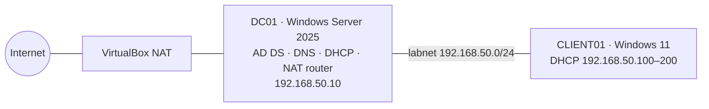

```mermaid
flowchart LR
    Internet((Internet)) --- NAT[VirtualBox NAT]
    NAT --- DC01["DC01 · Windows Server 2025<br/>AD DS · DNS · DHCP · NAT router<br/>192.168.50.10"]
    DC01 ---|labnet 192.168.50.0/24| CLIENT01["CLIENT01 · Windows 11<br/>DHCP 192.168.50.100–200"]
```
